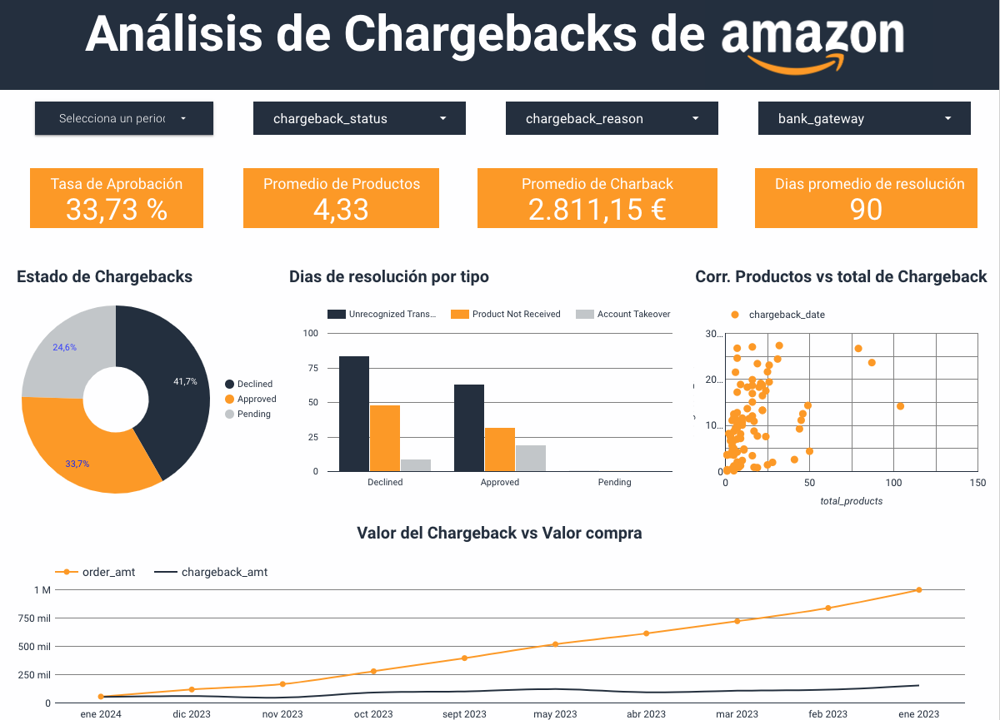

# Amazon Charback Analysis

## Overview
Este análisis explora los patrones de **Amazon Chargebacks** (disputas de transacciones) usando técnicas de análisis exploratorio de datos (EDA) y machine learning. El objetivo es identificar factores de riesgo y construir un modelo predictivo de probabilidad de chargeback por transacción.

## Dashboard Visual



*Dashboard interactivo mostrando análisis de chargebacks por región, producto, método de pago y tendencias temporales.*

---

## Descripción del Proyecto

El análisis cubre:

✅ **Análisis Geográfico:** Distribución de chargebacks por región  
✅ **Segmentación por Producto:** Identificación de categorías de mayor riesgo  
✅ **Análisis Temporal:** Tendencias de chargebacks a lo largo del tiempo  
✅ **Métodos de Pago:** Identificación de métodos más propensos a chargebacks  
✅ **Causas de Disputa:** Motivos principales de chargebacks  
✅ **Modelo Predictivo:** Predicción de probabilidad de chargeback por transacción  

---

## Contenido del Repositorio

```
Amazon Charback Analysis/
├── notebooks/
│   ├── 00_data_load_and_cleaning.ipynb
│   ├── 01_exploratory_analysis.ipynb
│   ├── 02_feature_engineering.ipynb
│   ├── 03_modeling.ipynb
│   └── 04_reporting_and_conclusions.ipynb
├── data/
│   └── [Archivos CSV/Parquet con datos de transacciones]
├── outputs/
│   └── [Gráficos y reportes generados]
├── dashboard.png
└── README.md
```

---

## Requisitos

- **Python 3.9** o superior
- **Jupyter Notebook** o **JupyterLab**

### Paquetes principales:
- `pandas` - Manipulación de datos
- `numpy` - Operaciones numéricas
- `matplotlib` - Visualizaciones estáticas
- `seaborn` - Visualizaciones estadísticas
- `scikit-learn` - Machine learning
- `plotly` - Visualizaciones interactivas (opcional)

### Instalación de dependencias

```bash
pip install -r requirements.txt
```

Si no existe `requirements.txt`, ejecuta:

```bash
pip install pandas numpy matplotlib seaborn scikit-learn plotly jupyter
```

---

## Cómo Ejecutar

### 1. Clona el repositorio
```bash
git clone https://github.com/JavierPradal/DataAnalytics-projects.git
cd "Amazon Charback Analysis"
```

### 2. Crea un entorno virtual (recomendado)
```bash
python -m venv venv

# Linux / macOS
source venv/bin/activate

# Windows
venv\Scripts\activate
```

### 3. Instala las dependencias
```bash
pip install -r requirements.txt
```

### 4. Inicia Jupyter
```bash
jupyter lab
# o
jupyter notebook
```

### 5. Ejecuta los notebooks en orden
1. `00_data_load_and_cleaning.ipynb` - Carga y limpieza de datos
2. `01_exploratory_analysis.ipynb` - Análisis exploratorio y visualizaciones
3. `02_feature_engineering.ipynb` - Creación de variables predictivas
4. `03_modeling.ipynb` - Entrenamiento y evaluación de modelos
5. `04_reporting_and_conclusions.ipynb` - Reportes finales y conclusiones

---

## Flujo de Trabajo

```
📥 Data Loading & Cleaning
        ↓
📊 Exploratory Analysis (EDA)
        ↓
⚙️ Feature Engineering
        ↓
🤖 Model Training & Evaluation
        ↓
📈 Reporting & Insights
```

---

## Resultados Esperados

### Visualizaciones Clave:
- 📍 Mapa de calor de chargebacks por región
- 📈 Gráficos de tendencias temporales
- 📦 Distribución por categoría de producto
- 💳 Análisis de métodos de pago
- 🎯 Matriz de correlación

### Modelo Predictivo:
- Probabilidad de chargeback por transacción
- Métricas de evaluación: **ROC-AUC, Precision, Recall, F1-Score**
- Análisis de características más importantes (Feature Importance)

### Insights Operacionales:
- 🚨 Factores de riesgo identificados
- 💡 Recomendaciones para reducir chargebacks
- 🎯 Estrategias por segmento

---

## Notas Importantes

⚠️ **Seguridad de Datos:**
- Los datos sensibles NO deberían subirse al repositorio
- Usa variables de entorno o un archivo `.env` (ignorado por Git)
- Mantén credenciales y tokens seguros fuera del versionado

📝 **Datos:**
- Si los datos no están incluidos, sigue las instrucciones en los notebooks
- O descárgalos desde tu fuente de datos original

---

## Contribuciones

Si deseas contribuir al proyecto:

1. 🔀 Abre un **issue** describiendo tu propuesta
2. 🌳 Crea una rama con nombre descriptivo:
   ```bash
   git checkout -b feature/tu-propuesta
   ```
3. 📤 Envía un **pull request** con cambios claros y notebooks ejecutados

---

## Licencia

**MIT License** - Consulta [LICENSE](LICENSE) para más detalles

---

## Contacto

**Javier Pradal**  
🔗 [GitHub Profile](https://github.com/JavierPradal)  
📧 Para preguntas o sugerencias sobre este análisis, abre un issue en el repositorio

---

**Última actualización:** Agosto 2026
