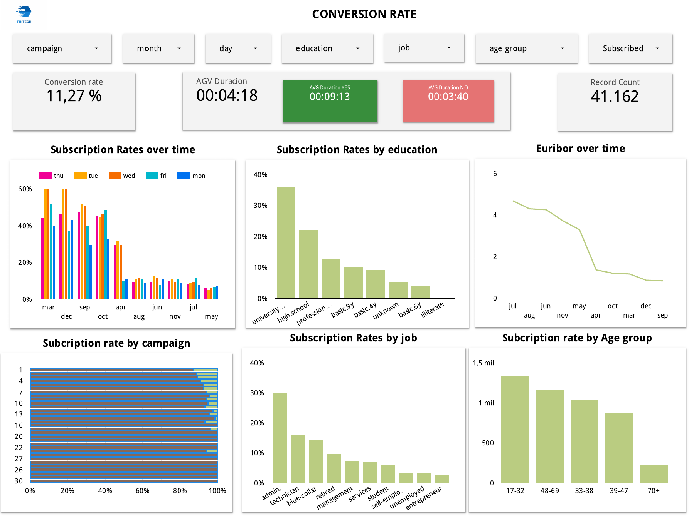
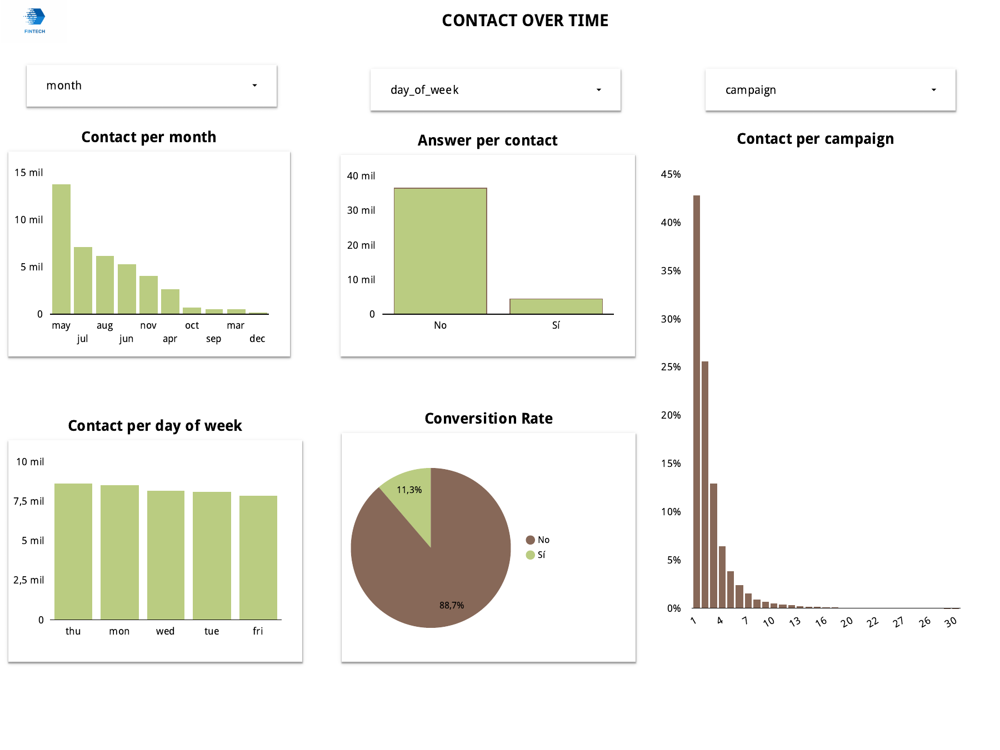
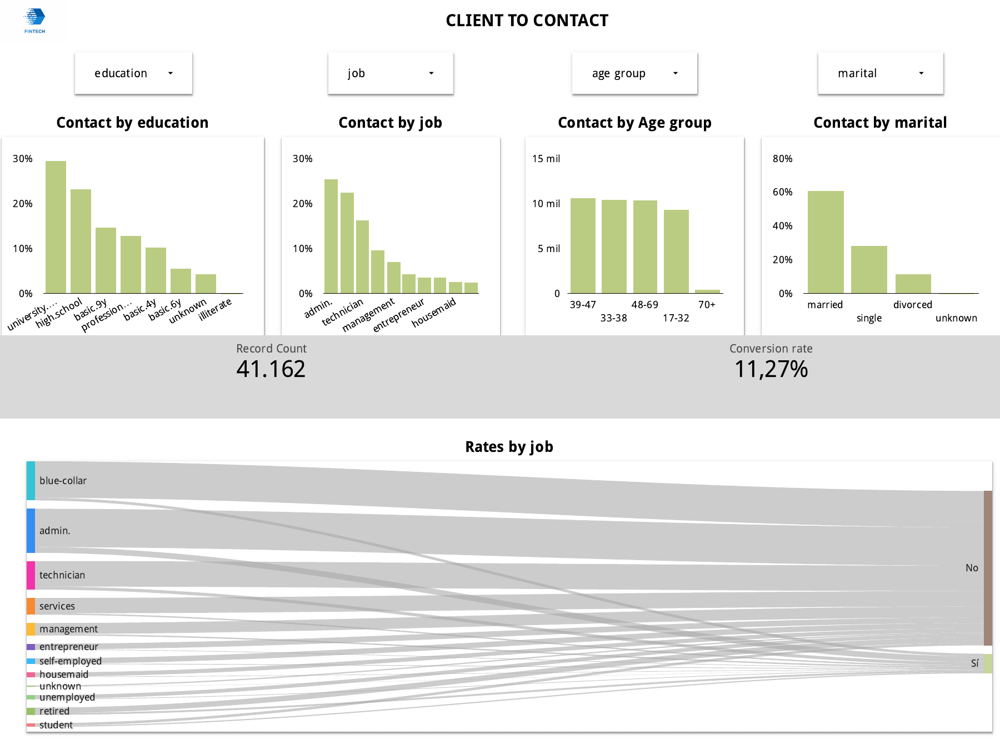
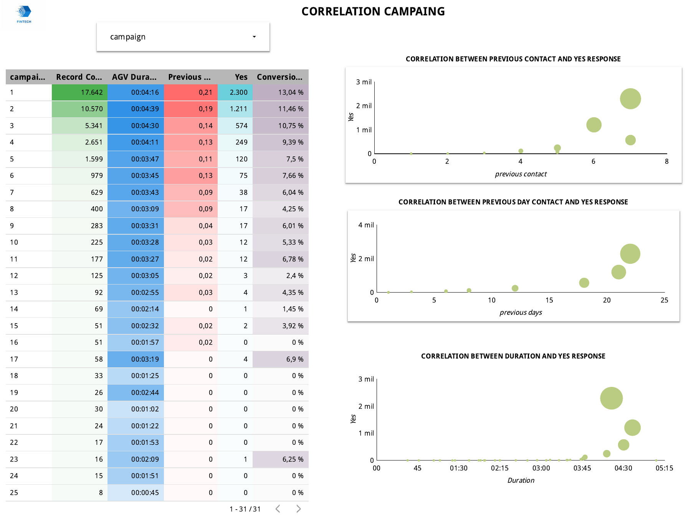

# 📊 Marketing Analytics for Fintech

## Descripción
Análisis completo de estrategias de marketing en el sector fintech, incluyendo métricas de rendimiento, insights del mercado y recomendaciones estratégicas.

## 📁 Contenidos

### 📄 Fintech_Report.pdf
Reporte ejecutivo con:
- **Análisis de Mercado** - Tendencias y oportunidades en fintech
- **Estrategias de Marketing Digital** - Canales y tácticas efectivas
- **Métricas y KPIs** - Indicadores de rendimiento clave
- **Visualizaciones** - Gráficos y dashboards de datos
- **Conclusiones y Recomendaciones** - Plan de acción

## 📊 Visualizaciones del Reporte

### Página 1 - Portada y Resumen Ejecutivo

### Página 2 - Análisis de Mercado

### Página 3 - Estrategias y Métricas

### Página 4 - Conclusiones y Recomendaciones

## 🎯 Objetivos
- Evaluar el panorama del marketing en fintech
- Identificar oportunidades de crecimiento
- Proporcionar estrategias basadas en datos
- Optimizar ROI en campañas digitales

## 📈 Palabras Clave
`fintech` `marketing analytics` `digital marketing` `data analysis` `financial technology`

## 📦 Archivos del Proyecto
- **Modelo_XGBoost_FINAL.ipynb** - Modelo de machine learning para predicción
- **bank-additional_bank-additional-full.csv** - Dataset de análisis
- **Fintech_Report.pdf** - Reporte completo en PDF

## 🔎 Sobre Modelo_XGBoost_FINAL.ipynb
A continuación se añade una descripción práctica y reproducible del notebook `Modelo_XGBoost_FINAL.ipynb`, para que lectorxs y usuarixs puedan entender qué hace, cómo reproducirlo y qué resultados esperar.

### Objetivo del notebook
- Entrenar y evaluar un modelo XGBoost para predecir la variable objetivo presente en `bank-additional_bank-additional-full.csv` (por ejemplo, respuesta a una campaña o conversión), optimizando rendimiento y explicabilidad.

### Contenido y secciones principales
1. Carga de datos
   - Lectura del CSV `bank-additional_bank-additional-full.csv`.
   - Inspección inicial: dimensiones, tipos, valores faltantes.
2. Preprocesamiento
   - Limpieza de valores nulos y tratamiento de outliers cuando aplica.
   - Codificación de variables categóricas (One-Hot Encoding o Label Encoding según el caso).
   - Escalado/normalización de variables numéricas si es necesario.
   - Creación/selección de features: generación de variables temporales, agregados y transformaciones relevantes.
3. División de datos
   - Split train/test (p. ej. 80/20) con seed para reproducibilidad.
   - Opcional: validación cruzada (k-fold) o validación con TimeSeriesSplit si aplica.
4. Entrenamiento del modelo
   - Uso de XGBoost (xgboost.XGBClassifier / XGBRegressor según objetivo).
   - Búsqueda de hiperparámetros mediante GridSearchCV o RandomizedSearchCV (parámetros típicos: n_estimators, max_depth, learning_rate, subsample, colsample_bytree).
   - Entrenamiento final con los mejores hiperparámetros.
5. Evaluación
   - Métricas reportadas: ROC AUC, Accuracy, Precision, Recall, F1-score (para clasificación) — o RMSE/MAE/R2 para regresión.
   - Curvas ROC, matriz de confusión y reportes de clasificación.
6. Interpretabilidad
   - Importancia de features (feature_importances_ y/o SHAP values).
   - Visualizaciones de las características más relevantes y su impacto en la predicción.
7. Resultados y conclusiones
   - Resumen de desempeño del modelo.
   - Recomendaciones prácticas derivadas del modelo (p. ej. variables con mayor impacto en la conversión).
8. Exportar modelo
   - Guardado del modelo entrenado (p. ej. con joblib o pickle) para uso posterior en producción o scoring offline.

### Requisitos para ejecutar
- Python 3.8+ recomendado
- Dependencias principales (ejemplos):
  - pandas
  - numpy
  - scikit-learn
  - xgboost
  - shap (opcional, para interpretabilidad)
  - matplotlib / seaborn

Se recomienda crear un entorno virtual e instalar dependencias con `pip install -r requirements.txt` si existe, o instalar las librerías listadas.

### Cómo ejecutar
1. Clonar el repositorio y navegar a la carpeta del proyecto.
2. Asegurarse de tener `bank-additional_bank-additional-full.csv` en la misma carpeta o actualizar la ruta en el notebook.
3. Abrir `Modelo_XGBoost_FINAL.ipynb` en Jupyter Notebook o JupyterLab.
4. Ejecutar las celdas secuencialmente. Utilizar la celda con `random_state`/`seed` definida para obtener resultados reproducibles.

### Salidas esperadas
- Métricas de evaluación en conjunto de validación y test.
- Gráficos: curva ROC, matriz de confusión, importancias de features, gráficos SHAP (si se usa).
- Archivo de modelo exportado (p. ej. `modelo_xgboost.pkl`), si está incluida la celda de guardado.

### Notas y recomendaciones
- Documentar en el notebook las decisiones de preprocesamiento y la razón de elegir XGBoost.
- Si el dataset está desbalanceado, considerar técnicas como oversampling (SMOTE), undersampling o ajuste de `scale_pos_weight` en XGBoost.
- Para producción, serializar pipeline completo (preprocesamiento + modelo) y versionar el artefacto.
- Añadir pruebas rápidas o un script `predict.py` para scoring batch si se desea reutilizar el modelo fuera del notebook.

---

## 🔗 Acceso Rápido
[📥 Descargar Reporte](./Fintech_Report.pdf)

---
**Proyecto:** DataAnalytics-projects  
**Autor:** JavierPradal  
**Fecha:** 2026
